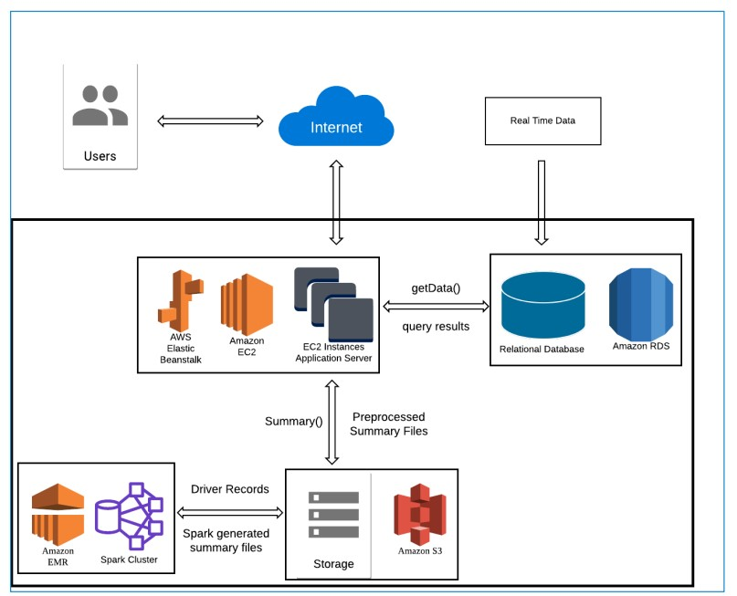
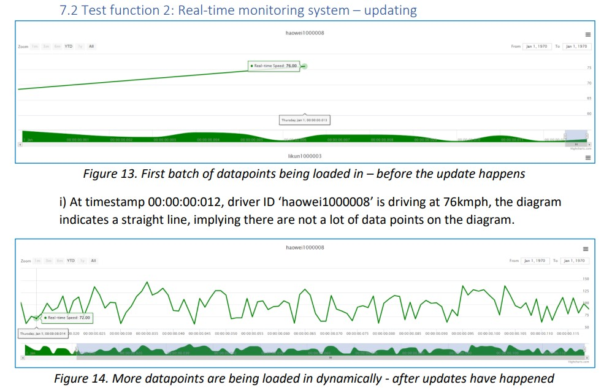
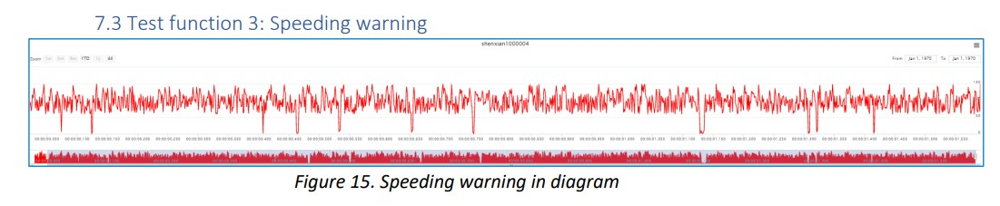
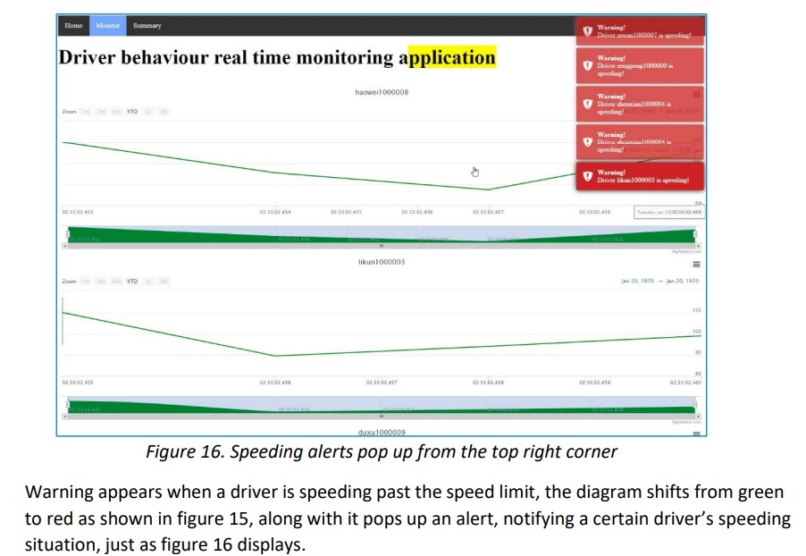
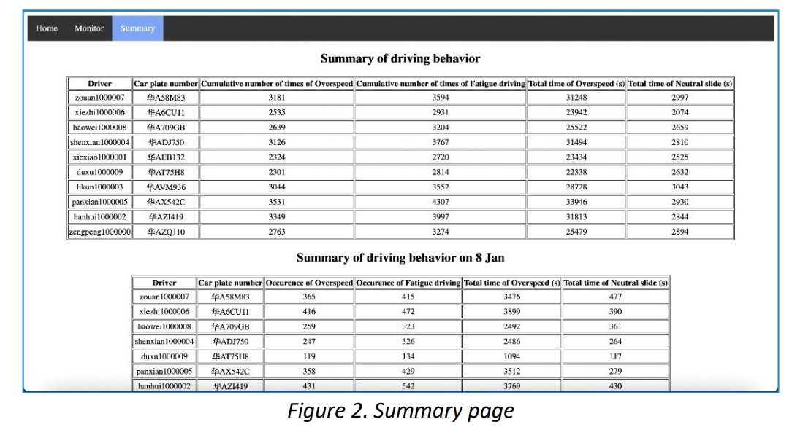

# Driving-behavior Monitoring site - a cloud computing project

In this project, we created a web application to illustrate the driving behavior of 10 
drivers over the period of January 1 to January 11, as well as visualizing their driving speed in 
diagrams for monitoring their tendencies of dangerous maneuvers. 

Operating systems used in the development process: Windows and MacOS

- Programming Languages: Python 3 – version: 3.7, 3.8
- Required packages: Flask, mysql-connector, ast, pyspark, PyPika, python-dotenv etc. 
(more in requirements.txt)
- Languages used for web development: HTML, CSS, JavaScript
- DBMS: MySQL 
- AWS services used:
  - AWS EMR, Spark – Generating summary
  - AWS RDS – Cloud database system
  - AWS S3 – Source files storage
  - AWS Beanstalk, EC2 – Cloud web application deployment

### Deployment model:

## User Interface
Real-time monitoring function

Warnings

Summary

## Folder structure
- **/pictures**: Pictures used in README.md
- **/data-analysis**: Python files used for Spark analysis
- **/app-demo**: Files to construct the web app for monitoring and displaying driving behaviours.
